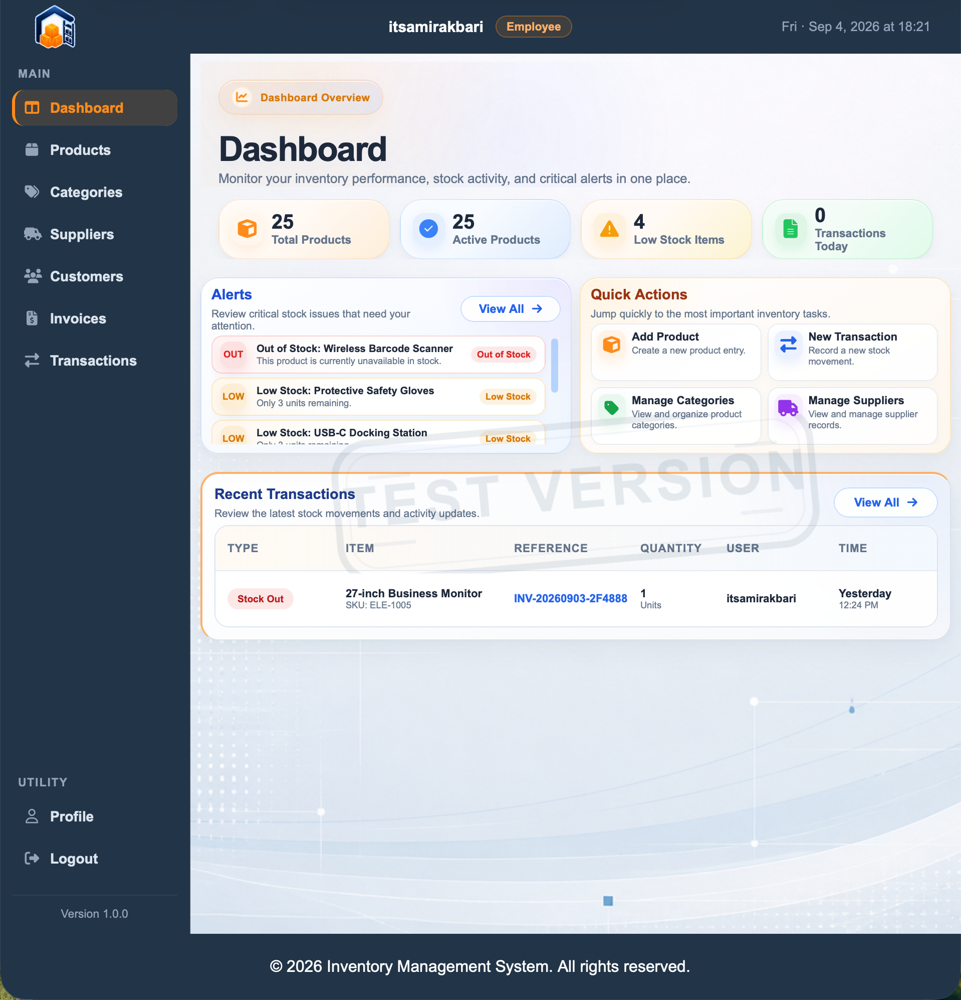
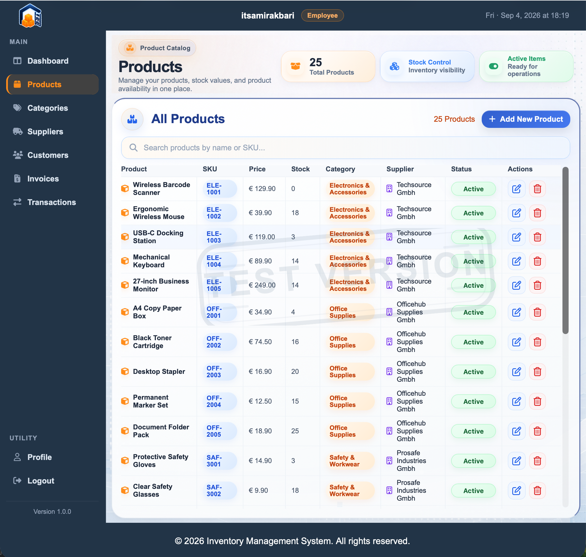

# Inventory Management System

Eine webbasierte Anwendung zur Verwaltung von Produkten, Kategorien, Lieferanten und Lagerbewegungen.

## Funktionen

- Registrierung, Anmeldung und E-Mail-Verifizierung
- Passwort-Zurücksetzung per E-Mail
- Verwaltung von Produkten und Kategorien
- Verwaltung von Lieferanten
- Wareneingänge und Warenausgänge
- Bestandskorrekturen
- Übersicht aller Lagerbewegungen
- Benutzerprofile und Rollen
- Sichere Datenbanktransaktionen mit automatischem Rollback
- Automatisierte Tests für wichtige Datenbankfunktionen

## Screenshots

### Startseite


### Anmeldung


### Dashboard



### Produktverwaltung



### Lagerbewegungen


## Datenbank und Architektur

### Datenbankarchitektur


### Entity-Relationship-Diagramm


Das vollständige Datenbankschema ist als [PDF-Dokument](docs/images/database_schema.pdf) verfügbar.

## Verwendete Technologien

- Python 3
- Flask
- MySQL
- Jinja2
- HTML
- CSS
- JavaScript

## Installation

### 1. Repository herunterladen

```bash
git clone git@github.com:itsamirakbari/inventory-management-system.git
cd inventory-management-system
```

### 2. Virtuelle Python-Umgebung erstellen

```bash
python -m venv .venv
source .venv/bin/activate
```

### 3. Abhängigkeiten installieren

```bash
pip install -r requirements.txt
```

### 4. Umgebungsvariablen einrichten

Kopiere die Beispieldatei:

```bash
cp .env.example .env
```

Öffne anschließend `.env` und ersetze die Platzhalter durch deine lokalen Datenbank- und E-Mail-Einstellungen.

Die echte `.env`-Datei darf niemals auf GitHub hochgeladen werden.

### 5. MySQL-Datenbank erstellen

```bash
mysql -u root -p < database/database-schema.sql
```

### 6. Anwendung starten

```bash
python app.py
```

Öffne danach im Browser:

```text
http://127.0.0.1:5000
```

## Tests ausführen

```bash
python -m unittest discover -s tests
```

## Projektstruktur

```text
inventory-management-system/
├── app.py
├── config.py
├── db.py
├── database/
├── docs/
├── routes/
├── static/
├── templates/
├── tests/
└── utils/
```

## Sicherheit

Passwörter, geheime Schlüssel und lokale Einstellungen gehören ausschließlich in die Datei `.env`.

Die Datei `.env.example` enthält nur Platzhalter und kann sicher veröffentlicht werden.

Folgende Inhalte dürfen nicht auf GitHub hochgeladen werden:

- echte Passwörter
- geheime Schlüssel
- produktive Daten
- persönliche Zugangsdaten
- lokale Logdateien

## Lizenz

Für dieses Projekt wurde noch keine Lizenz ausgewählt. Bis eine Lizenzdatei ergänzt wird, bleiben alle Rechte vorbehalten.