# Inventory Management System Pro

InventoryPro ist eine webbasierte Flask-Anwendung für die durchgängige Verwaltung von Produkten, Kategorien, Lieferanten, Kunden, Rechnungen und Lagerbewegungen. Die finale Version verbindet Stammdaten, Verkauf und Bestand in einem gemeinsamen Workflow: Eine Rechnung wird einem aktiven Kunden zugeordnet, enthält verfügbare Produkte und erzeugt für jede Position die passende Lagerbewegung.

## Highlights der finalen Version

- Zentrales Dashboard mit Produkt-KPIs, Bestandswarnungen, Schnellaktionen und aktuellen Lagerbewegungen
- Vollständige Verwaltung von Kategorien, Lieferanten und Produkten
- Aktivierbare und deaktivierbare Produkte und Kunden
- Kundenverwaltung mit Kontakt-, Adress- und Kommunikationsdaten
- Rechnungserstellung mit mehreren Positionen, Mengenprüfung und automatischer Gesamtsumme
- Eindeutige Rechnungsnummern im Format `INV-YYYYMMDD-XXXXXX`
- Rechnungsstatus `open` und `paid`
- Eigene Rechnungsdetailansicht mit Kunden-, Positions- und Erstellerinformationen
- Rechnungsdownload als mehrseitiges PDF sowie druckoptimierte Browseransicht
- Automatische `stock_out`-Lagerbewegung mit Referenz auf die Rechnungsnummer
- Passende Transaktionsgründe abhängig von der gewählten Bewegungsart
- Manuelle Verkaufsbuchungen gesperrt, da Verkäufe automatisch über Rechnungen gebucht werden
- Transaktionssichere Bestandsänderungen mit Zeilensperre und Rollback
- Suche, Filterung und konsistente Tabellenansichten in allen Verwaltungsbereichen
- Registrierung, Anmeldung, E-Mail-Verifizierung, Passwort-Zurücksetzung und Profilverwaltung
- Rollenmodell für `admin` und `employee`

## Fachlicher Ablauf

### Kunden und Rechnungen

1. Ein Kunde wird mit vollständiger Rechnungsadresse angelegt und kann aktiviert oder deaktiviert werden.
2. Beim Erstellen einer Rechnung stehen ausschließlich aktive Kunden und aktive Produkte mit positivem Bestand zur Auswahl.
3. Jede Produktposition darf nur einmal vorkommen; die angeforderte Menge darf den verfügbaren Bestand nicht überschreiten.
4. Die Anwendung speichert Rechnungskopf und Positionen und berechnet den Gesamtbetrag aus Menge und aktuellem Produktpreis.
5. Für jede Rechnungsposition wird eine Lagerbewegung vom Typ `stock_out` mit Grund `sale` und der Rechnungsnummer als Referenz erstellt.
6. Die Bestandsänderung wird innerhalb einer Datenbanktransaktion ausgeführt und verhindert negative Bestände.
7. Die fertige Rechnung kann geöffnet, als bezahlt markiert, gedruckt oder als PDF heruntergeladen werden.

### Lagerbewegungen

Unterstützte Bewegungsarten:

- `stock_in`
- `stock_out`
- `adjustment_in`
- `adjustment_out`

Unterstützte Gründe:

- Einkauf und Verkauf
- Eingangs- und Ausgangsretoure
- Beschädigte oder verlorene Ware
- Inventurkorrektur
- Manuelle Korrektur
- Sonstiger Grund mit Pflichtnotiz

Manuelle Verkaufsbewegungen sind ausgeschlossen: Beim Erstellen einer Rechnung erzeugt die Anwendung für jede Position automatisch eine `stock_out`-Transaktion mit dem Grund `sale` und der Rechnungsnummer als Referenz. Im manuellen Transaktionsformular werden ausschließlich die zur gewählten Bewegungsart passenden Gründe angeboten.

## Screenshots

Die folgenden Ansichten zeigen den vollständigen Ablauf der Demonstrationsversion – vom öffentlichen Einstieg über die tägliche Bestandskontrolle bis zur Rechnungs- und Transaktionsverwaltung.

### 1. Startseite

Die zweisprachige Startseite stellt InventoryPro, seinen Funktionsumfang und den Zugang zur Demonstrationsversion vor.

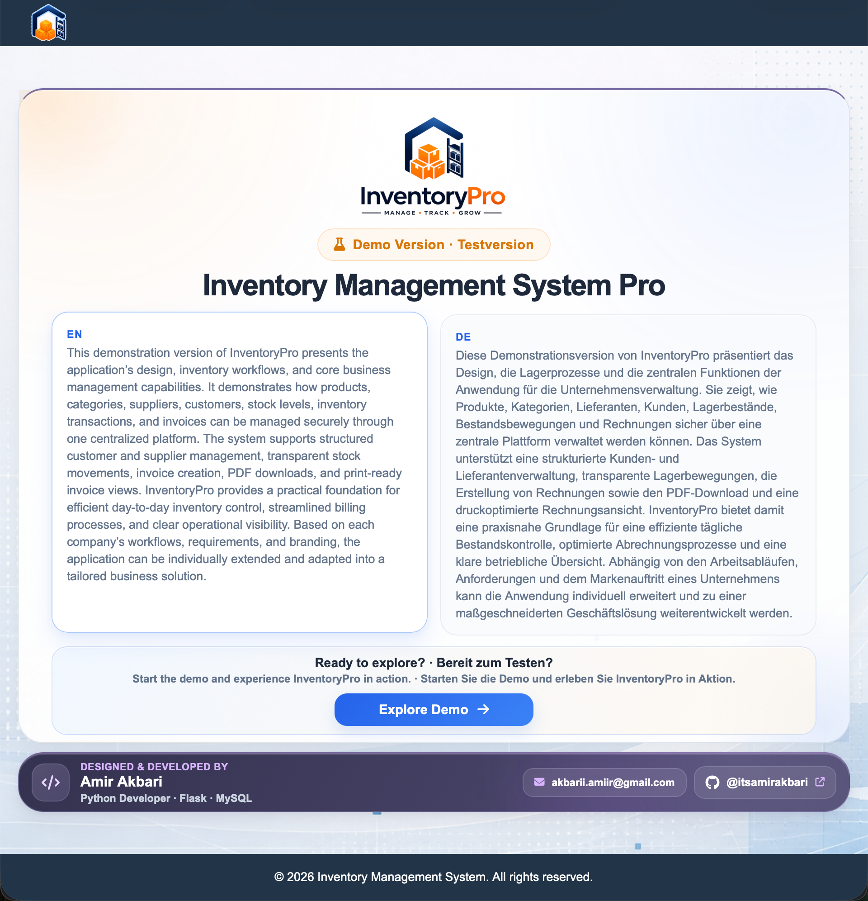

### 2. Sichere Anmeldung

Die Anmeldeseite schützt die internen Verwaltungsbereiche und bietet zusätzlich Registrierung und Passwortwiederherstellung.

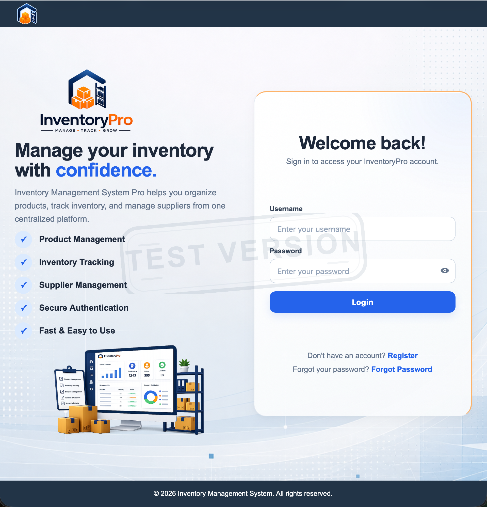

### 3. Dashboard und Bestandsüberblick

Das Dashboard bündelt Produktkennzahlen, Warnungen bei niedrigen Beständen, Schnellaktionen und die neuesten Lagerbewegungen.

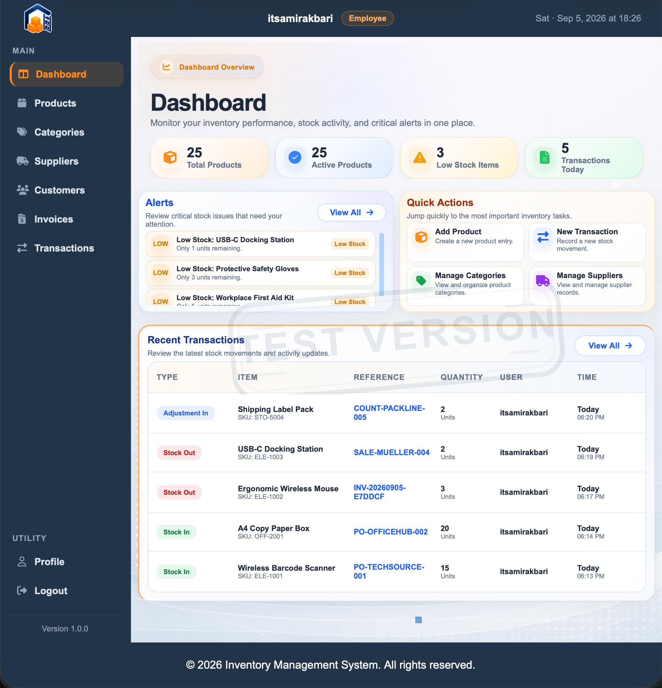

### 4. Produktverwaltung

Die zentrale Produktübersicht zeigt Artikel, SKU, Preise, aktuelle Bestände, Kategorien, Lieferanten und Aktivstatus in einer durchsuchbaren Tabelle.

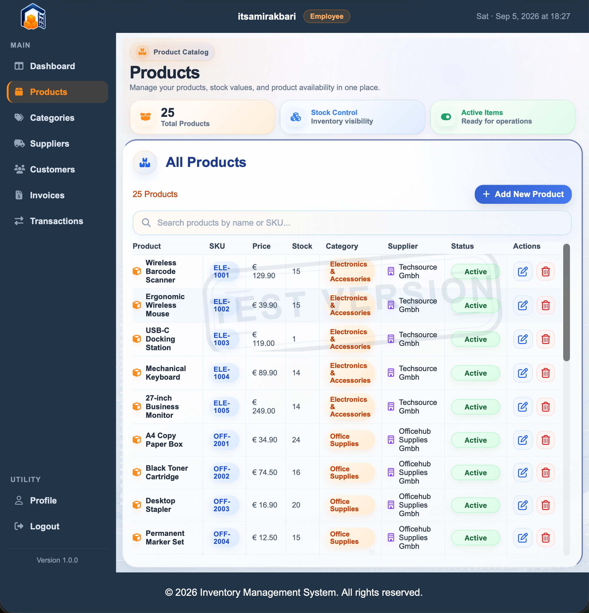

### 5. Lieferantenverwaltung

Lieferanten werden mit Ansprechpartnern, Kommunikationsdaten und vollständigen Adressen zentral verwaltet.

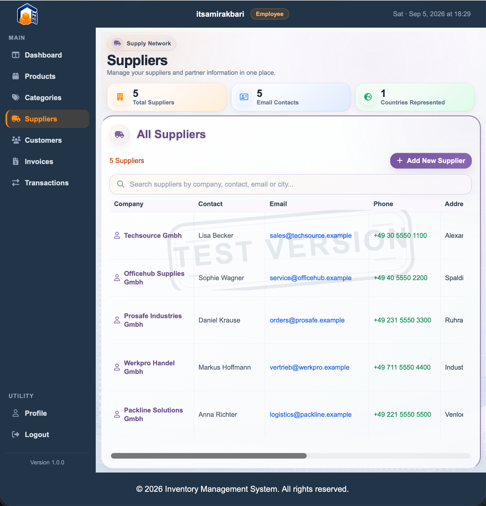

### 6. Rechnungsübersicht

Die Rechnungsübersicht zeigt Rechnungsnummern, zugeordnete Kunden, Ersteller, Termine, Gesamtbeträge und den aktuellen Zahlungsstatus.

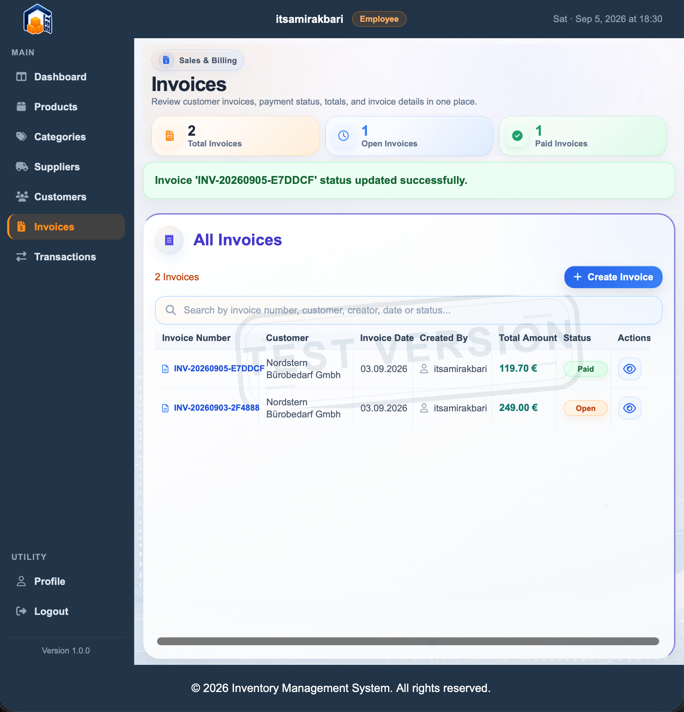

### 7. Rechnungsdetail und Ausgabe

Die Detailansicht verbindet Rechnungs- und Kundendaten mit allen Positionen und Summen. Fertige Rechnungen können direkt als PDF heruntergeladen oder druckoptimiert geöffnet werden.

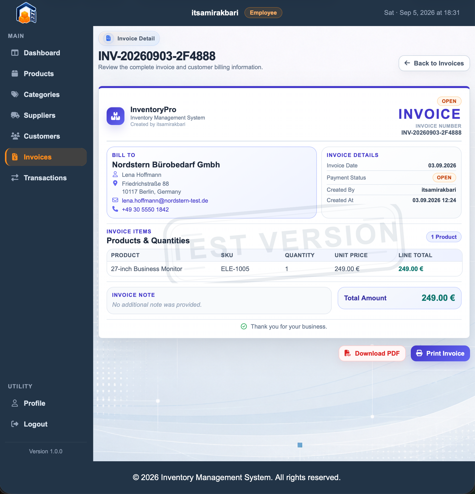

### 8. Lagerbewegungen und Filter

Alle Zu- und Abgänge sowie Bestandskorrekturen sind mit Produkt, Menge, Grund, Referenz, Benutzer und Datum nachvollziehbar. Produkt-, Benutzer- und Datumsfilter sowie die Volltextsuche unterstützen die gezielte Auswertung.

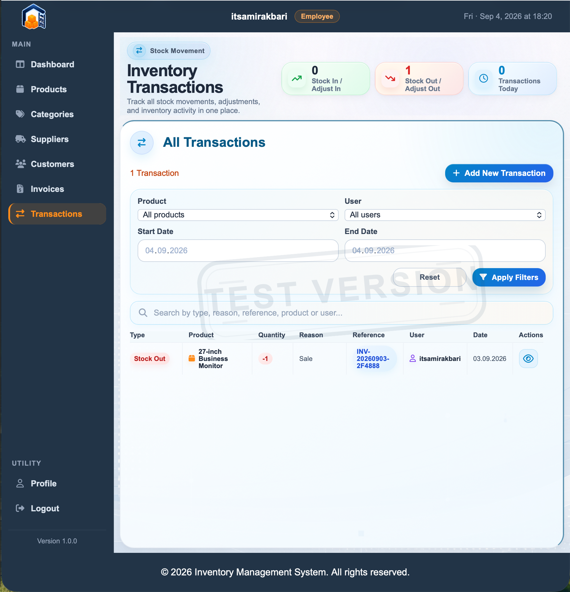

### 9. Neue Lagerbewegung erfassen

Über das Transaktionsformular werden Bewegungsart, Produkt, Menge, Grund, Referenz und optionale Hinweise strukturiert erfasst.

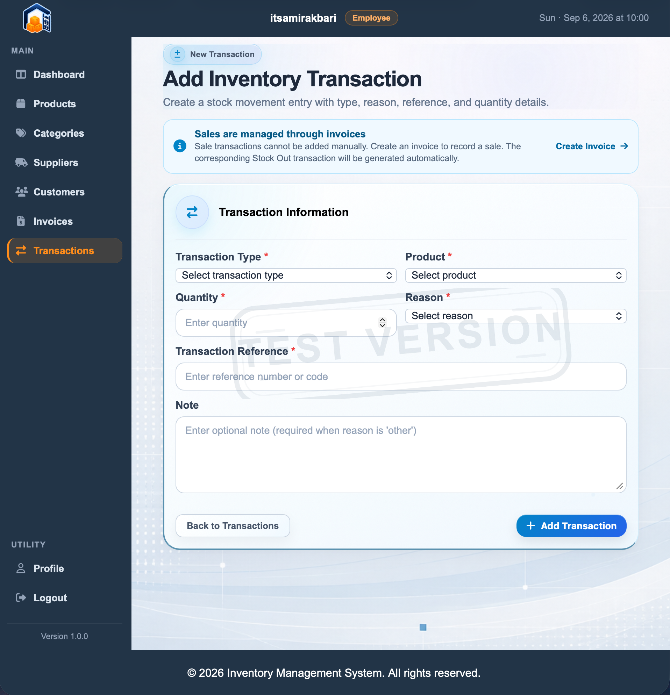

## Datenbank und Architektur

Die finale Datenbank besteht aus acht Tabellen:

- `users`
- `categories`
- `suppliers`
- `products`
- `customers`
- `invoices`
- `invoice_items`
- `inventory_transactions`

### Datenzugriffsarchitektur

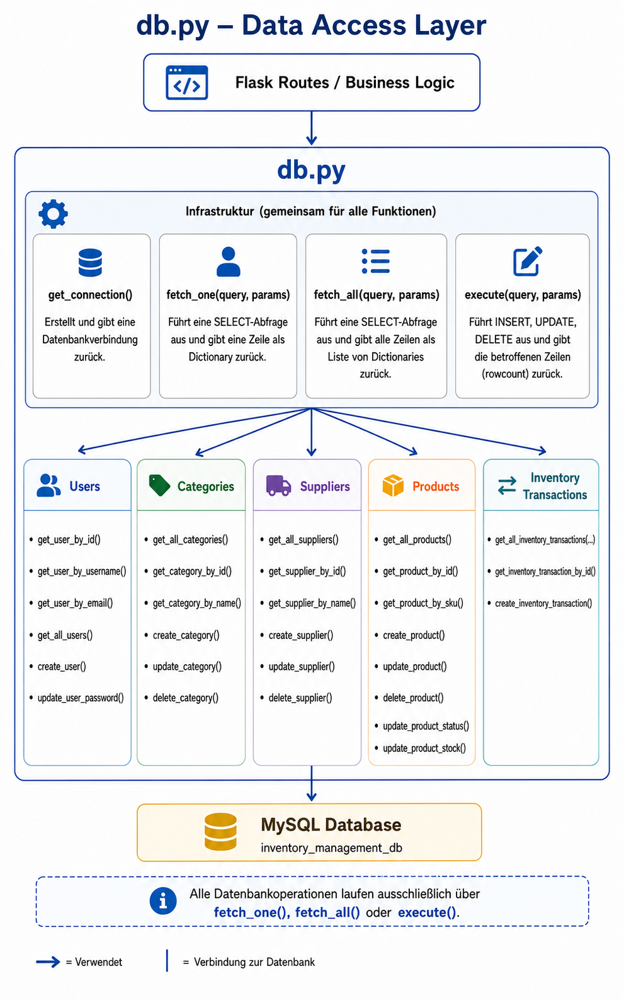

### Entity-Relationship-Diagramm

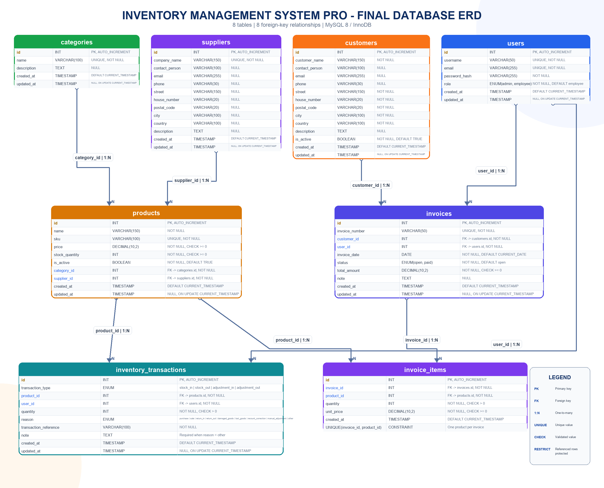

Das vollständige, tabellarische Datenbankschema ist zusätzlich als [PDF-Dokument](docs/images/database_schema.pdf) verfügbar. Das ausführbare SQL-Schema befindet sich unter [`database/database-schema.sql`](database/database-schema.sql).

## Technologie

- Python 3.13
- Flask 3.1
- MySQL 8 mit InnoDB und `utf8mb4`
- Jinja2
- HTML, CSS und JavaScript
- ReportLab und pypdf für Rechnungs-PDFs

## Installation

### 1. Repository klonen

```bash
git clone git@github.com:itsamirakbari/inventory-management-system.git
cd inventory-management-system
```

### 2. Virtuelle Umgebung erstellen

```bash
python3 -m venv .venv
source .venv/bin/activate
```

Unter Windows:

```powershell
py -m venv .venv
.venv\Scripts\activate
```

### 3. Abhängigkeiten installieren

```bash
python -m pip install --upgrade pip
python -m pip install -r requirements.txt
```

### 4. Umgebungsvariablen einrichten

Kopiere die Beispieldatei:

```bash
cp .env.example .env
```

Anschließend alle Platzhalter in `.env` durch lokale MySQL- und SMTP-Werte ersetzen. Für Kunden und Rechnungen sind keine zusätzlichen Geheimnisse erforderlich; diese Funktionen verwenden dieselbe MySQL-Verbindung.

Eine sichere `SECRET_KEY` kann so erzeugt werden:

```bash
python -c "import secrets; print(secrets.token_hex(32))"
```

### 5. Datenbank erstellen

Voraussetzung ist MySQL 8 oder neuer.

```bash
mysql -u root -p < database/database-schema.sql
```

Das Schema erstellt die Datenbank `inventory_management_system` mit allen acht Tabellen, Prüfbedingungen, eindeutigen Schlüsseln und Fremdschlüsselbeziehungen.

### 6. Anwendung starten

```bash
python app.py
```

Öffne danach im Browser:

```text
http://127.0.0.1:5000
```

## Tests

```bash
python -m unittest discover -s tests -v
```

Die Tests prüfen insbesondere die allgemeinen Datenbankoperationen sowie das atomare Zusammenspiel von Lagerbewegung und Bestandsänderung.

## Projektstruktur

```text
inventory-management-system/
├── app.py                         # Flask-Anwendung und Blueprint-Registrierung
├── config.py                      # Konfiguration aus Umgebungsvariablen
├── db.py                          # Datenzugriff und Bestands-Transaktionen
├── database/
│   └── database-schema.sql        # Finales MySQL-Schema
├── docs/images/                   # Screenshots und Datenbankdiagramme
├── pdf_templates/                 # Vorlagen für Rechnungs-PDFs
├── routes/                        # Auth, Dashboard und Fachbereiche
├── static/                        # CSS, JavaScript und Bilder
├── templates/                     # Jinja2-Seiten und Rechnungsansichten
├── tests/                         # Datenbank- und Transaktionstests
└── utils/                         # Validierung, E-Mail und PDF-Erzeugung
```

## Sicherheit

- `.env` bleibt lokal und ist über `.gitignore` ausgeschlossen.
- `.env.example` enthält ausschließlich Platzhalter und darf veröffentlicht werden.
- Passwörter werden ausschließlich als Hash gespeichert.
- SQL-Zugriffe verwenden parametrisierte Abfragen.
- Geschützte Bereiche erfordern eine gültige Sitzung.
- Fremdschlüssel verhindern das Löschen noch verwendeter Stammdaten.
- Lagerabgänge können keinen negativen Bestand erzeugen.

Folgende Inhalte dürfen niemals in das Repository gelangen:

- echte Datenbank- oder E-Mail-Passwörter
- geheime Schlüssel
- produktive Kunden- und Rechnungsdaten
- persönliche Zugangsdaten
- lokale Logdateien

## Lizenz

Für dieses Projekt wurde noch keine Lizenz ausgewählt. Bis eine Lizenzdatei ergänzt wird, bleiben alle Rechte vorbehalten.
